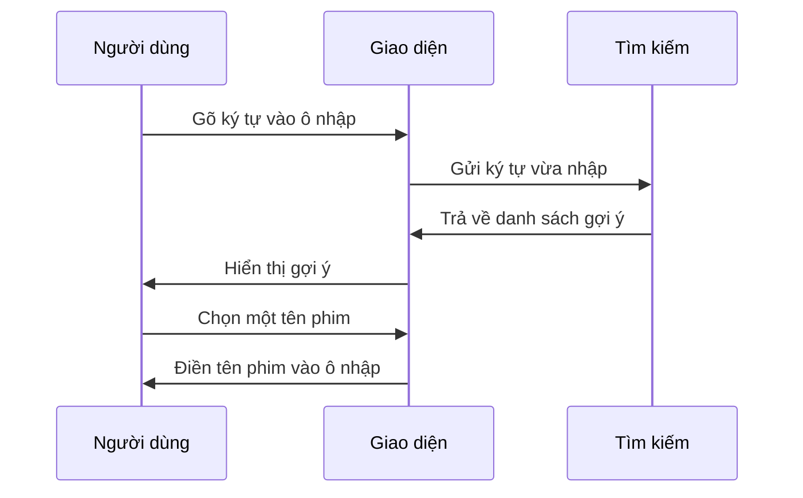

# Chapter 1: Giao diện người dùng và tự động hoàn thành (Giao diện & Autocomplete)


## Động lực: Tại sao cần giao diện tự động hoàn thành?

Hãy tưởng tượng bạn muốn tìm một bộ phim yêu thích trên ứng dụng `netflix-rec`. Nếu phải nhớ và gõ chính xác tên phim, đôi khi bạn sẽ gặp khó khăn: có thể bạn không nhớ hết tên, hoặc gõ sai chính tả. Điều này khiến việc tìm kiếm trở nên chậm và dễ gây nản lòng.

Giải pháp là gì? Đó chính là **giao diện tự động hoàn thành**! Khi bạn bắt đầu gõ vài ký tự đầu tiên, hệ thống sẽ tự động gợi ý các tên phim phù hợp. Bạn chỉ cần chọn đúng tên phim từ danh sách gợi ý, giống như khi tìm kiếm trên Google.

## Tính năng chính của giao diện tự động hoàn thành

- **Tiết kiệm thời gian:** Không cần gõ hết tên phim, chỉ cần vài ký tự là đã có gợi ý.
- **Tránh nhập sai:** Hạn chế lỗi chính tả hoặc nhầm lẫn tên phim.
- **Trải nghiệm thân thiện:** Người dùng cảm thấy dễ dàng và thích thú khi sử dụng.

## Cách hoạt động của giao diện tự động hoàn thành

### 1. Ô nhập liệu (Input)

Người dùng sẽ thấy một ô nhập liệu trên giao diện. Khi bắt đầu gõ, hệ thống sẽ lắng nghe và xử lý nội dung bạn nhập.

```html
<input id="autoComplete" type="text" placeholder="Nhập tên phim...">
```

**Giải thích:**  
Đây là ô để bạn nhập tên phim. Khi bạn gõ, hệ thống sẽ tự động gợi ý.

---

### 2. Kết nối dữ liệu phim

Hệ thống cần một danh sách các tên phim để so sánh và gợi ý.

```js
const films = ["Inception", "Interstellar", "Parasite", "Avengers", "Titanic"];
```

**Giải thích:**  
Đây là một mảng chứa tên các bộ phim. Khi bạn gõ, hệ thống sẽ tìm kiếm trong danh sách này.

---

### 3. Kích hoạt tính năng tự động hoàn thành

Đoạn mã dưới đây sử dụng thư viện `autoComplete` để tạo tính năng gợi ý:

```js
new autoComplete({
    data: { src: films },
    selector: "#autoComplete",
    threshold: 2,
    maxResults: 5,
    highlight: true,
    onSelection: feedback => {
        document.getElementById('autoComplete').value = feedback.selection.value;
    }
});
```

**Giải thích từng dòng:**
- `data: { src: films }`: Sử dụng danh sách phim làm nguồn dữ liệu.
- `selector: "#autoComplete"`: Gắn tính năng này vào ô nhập liệu có id là `autoComplete`.
- `threshold: 2`: Bắt đầu gợi ý khi bạn gõ ít nhất 2 ký tự.
- `maxResults: 5`: Hiển thị tối đa 5 kết quả gợi ý.
- `highlight: true`: Tô đậm phần trùng khớp trong kết quả.
- `onSelection`: Khi chọn một gợi ý, tự động điền vào ô nhập.

---

### 4. Trải nghiệm người dùng

**Ví dụ:**  
Bạn gõ "Ti", hệ thống sẽ gợi ý "Titanic". Nếu bạn gõ "In", sẽ có "Inception" và "Interstellar".

---

## Quy trình hoạt động bên trong

Khi bạn gõ vào ô nhập liệu, chuyện gì sẽ xảy ra? Hãy cùng xem qua một sơ đồ đơn giản:



**Giải thích:**  
- Khi bạn gõ, giao diện gửi ký tự đến phần tìm kiếm.
- Phần tìm kiếm lọc ra các tên phim phù hợp.
- Giao diện hiển thị các gợi ý.
- Bạn chọn một gợi ý, hệ thống sẽ tự động điền vào ô nhập.

---

## Bên trong mã nguồn: Tìm hiểu file `static/autocomplete.js`

Dưới đây là một đoạn mã tiêu biểu trong file `static/autocomplete.js`:

```js
new autoComplete({
    data: { src: films },
    selector: "#autoComplete",
    threshold: 2,
    maxResults: 5,
    highlight: true,
    onSelection: feedback => {
        document.getElementById('autoComplete').value = feedback.selection.value;
    }
});
```

**Giải thích:**  
- Đoạn mã này khởi tạo tính năng tự động hoàn thành cho ô nhập liệu.
- Khi bạn chọn một gợi ý, tên phim sẽ được điền vào ô nhập.

---

## Tổng kết

Trong chương này, bạn đã học cách giao diện tự động hoàn thành giúp người dùng nhập tên phim nhanh chóng, chính xác và tiện lợi hơn. Bạn cũng đã hiểu quy trình hoạt động cơ bản và cách triển khai tính năng này trong dự án `netflix-rec`.

Ở chương tiếp theo, chúng ta sẽ tìm hiểu cách **xử lý yêu cầu AJAX và hiển thị kết quả** khi người dùng chọn một bộ phim. Hãy tiếp tục khám phá tại:  
[Chương 2: Xử lý yêu cầu AJAX và hiển thị kết quả (AJAX & Hiển thị kết quả)](02_xử_lý_yêu_cầu_ajax_và_hiển_thị_kết_quả__ajax___hiển_thị_kết_quả__.md)

