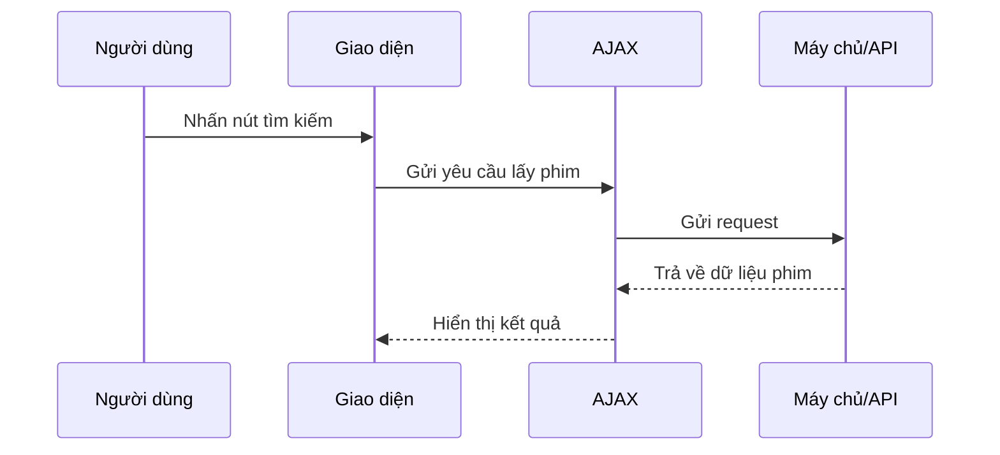

# Chapter 2: Xử lý yêu cầu AJAX và hiển thị kết quả (AJAX & Hiển thị kết quả)


## Chuyển tiếp từ chương trước

Ở [Chương 1: Giao diện người dùng và tự động hoàn thành (Giao diện & Autocomplete)](01_giao_diện_người_dùng_và_tự_động_hoàn_thành__giao_diện___autocomplete__.md), bạn đã học cách nhập tên phim dễ dàng nhờ tính năng tự động hoàn thành. Nhưng sau khi chọn hoặc nhập tên phim, làm sao để hệ thống lấy thông tin phim và hiển thị cho bạn mà không cần tải lại trang? Đó chính là nhiệm vụ của **AJAX**!

---

## Động lực: Tại sao cần AJAX?

Hãy tưởng tượng bạn vừa nhập xong tên phim "Inception" và nhấn nút tìm kiếm. Nếu mỗi lần như vậy trang web lại tải lại toàn bộ, trải nghiệm sẽ rất chậm và không mượt mà. AJAX giúp bạn **gửi yêu cầu và nhận kết quả** ngay trên trang hiện tại, giống như gọi một người phục vụ mang món ăn đến tận bàn mà bạn không cần rời chỗ.

**Tóm lại:** AJAX giúp trang web phản hồi nhanh, hiển thị kết quả phim, diễn viên, poster, đánh giá... ngay lập tức mà không cần tải lại trang.

---

## Các khái niệm chính

### 1. AJAX là gì?

- **AJAX** (Asynchronous JavaScript and XML) là kỹ thuật giúp trình duyệt **gửi và nhận dữ liệu với máy chủ** mà không cần tải lại trang.
- Nhờ AJAX, khi bạn nhấn nút tìm kiếm, dữ liệu phim sẽ được lấy về và hiển thị ngay lập tức.

### 2. Quy trình xử lý yêu cầu AJAX

Quy trình cơ bản gồm 3 bước:

1. **Người dùng nhấn nút tìm kiếm** (hoặc chọn phim).
2. **AJAX gửi yêu cầu** đến máy chủ hoặc API để lấy thông tin phim.
3. **Nhận kết quả và hiển thị** lên giao diện cho người dùng.

---

## Ví dụ thực tế: Tìm kiếm phim với AJAX

### Bước 1: Lắng nghe sự kiện nhấn nút

Khi bạn nhập tên phim và nhấn nút, đoạn mã sau sẽ được kích hoạt:

```js
$('.movie-button').on('click', function() {
  var title = $('.movie').val();
  load_details(my_api_key, title);
});
```

**Giải thích:**  
- Khi nút tìm kiếm được nhấn, lấy tên phim từ ô nhập và gọi hàm `load_details` để bắt đầu quá trình lấy thông tin phim.

---

### Bước 2: Gửi yêu cầu AJAX để lấy thông tin phim

```js
function load_details(my_api_key, title) {
  $.ajax({
    type: 'GET',
    url: 'https://api.themoviedb.org/3/search/movie?api_key=' + my_api_key + '&query=' + title,
    success: function(movie) {
      // Xử lý kết quả ở đây
    }
  });
}
```

**Giải thích:**  
- Sử dụng AJAX để gửi yêu cầu GET đến API phim.
- Nếu thành công, hàm `success` sẽ nhận được dữ liệu phim.

---

### Bước 3: Hiển thị kết quả lên giao diện

Sau khi nhận được dữ liệu phim, bạn có thể cập nhật giao diện như sau:

```js
success: function(movie) {
  if (movie.results.length < 1) {
    $('.fail').css('display', 'block');
    $('.results').css('display', 'none');
  } else {
    $('.results').css('display', 'block');
    // Hiển thị thông tin phim tại đây
  }
}
```

**Giải thích:**  
- Nếu không tìm thấy phim, hiển thị thông báo lỗi.
- Nếu có kết quả, hiển thị phần kết quả phim.

---

## Minh họa quy trình AJAX

Hãy xem quy trình này qua sơ đồ sau:



**Giải thích:**  
- Người dùng chỉ cần nhấn nút, mọi thứ còn lại AJAX sẽ lo: gửi yêu cầu, nhận kết quả và cập nhật giao diện.

---

## Tìm hiểu sâu hơn: Bên trong file `static/recommend.js`

### 1. Kích hoạt nút tìm kiếm

```js
const source = document.getElementById('autoComplete');
source.addEventListener('input', function(e) {
  if (e.target.value == "") {
    $('.movie-button').attr('disabled', true);
  } else {
    $('.movie-button').attr('disabled', false);
  }
});
```

**Giải thích:**  
- Nút tìm kiếm chỉ được bật khi bạn đã nhập tên phim.

---

### 2. Gửi yêu cầu lấy thông tin phim

```js
$('.movie-button').on('click', function() {
  var title = $('.movie').val();
  load_details(my_api_key, title);
});
```

**Giải thích:**  
- Khi nhấn nút, gọi hàm `load_details` để bắt đầu lấy thông tin phim.

---

### 3. Lấy thông tin phim từ API

```js
function load_details(my_api_key, title) {
  $.ajax({
    type: 'GET',
    url: 'https://api.themoviedb.org/3/search/movie?api_key=' + my_api_key + '&query=' + title,
    success: function(movie) {
      // Xử lý kết quả
    }
  });
}
```

**Giải thích:**  
- Gửi yêu cầu đến API phim để lấy thông tin dựa trên tên phim bạn nhập.

---

### 4. Hiển thị kết quả hoặc thông báo lỗi

```js
success: function(movie) {
  if (movie.results.length < 1) {
    $('.fail').css('display', 'block');
    $('.results').css('display', 'none');
  } else {
    $('.results').css('display', 'block');
    // Hiển thị thông tin phim
  }
}
```

**Giải thích:**  
- Nếu không có kết quả, hiển thị thông báo lỗi.
- Nếu có phim, hiển thị thông tin phim cho bạn.

---

## Tổng kết quy trình bên trong

Khi bạn nhấn nút tìm kiếm:

1. **Giao diện** kiểm tra bạn đã nhập tên phim chưa.
2. **AJAX** gửi yêu cầu đến API phim.
3. **API** trả về dữ liệu phim.
4. **AJAX** nhận dữ liệu và cập nhật giao diện, hiển thị thông tin phim hoặc thông báo lỗi.

---

## Kết luận

Qua chương này, bạn đã hiểu cách **AJAX** giúp trang web lấy và hiển thị thông tin phim một cách mượt mà, không cần tải lại trang. Đây là bước quan trọng để tạo trải nghiệm người dùng hiện đại và tiện lợi.

Ở chương tiếp theo, bạn sẽ khám phá cách **quản lý các route trong Flask và luồng hoạt động phía máy chủ** để phục vụ các yêu cầu AJAX này. Hãy tiếp tục với:  
[Chương 3: Quản lý Flask routes và luồng hoạt động (Luồng hoạt động Flask)](03_quản_lý_flask_routes_và_luồng_hoạt_động__luồng_hoạt_động_flask__.md)

