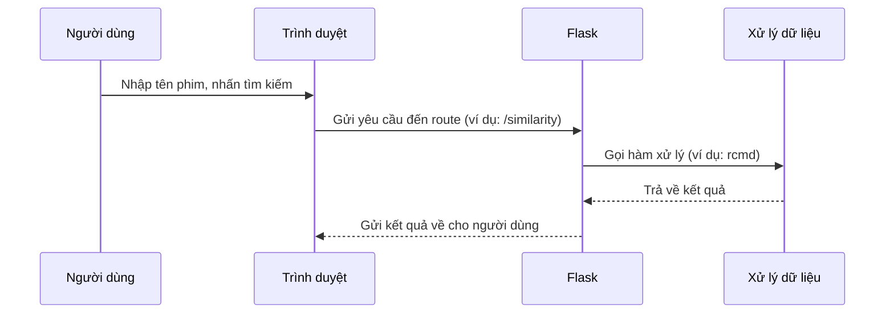

# Chapter 3: Quản lý Flask routes và luồng hoạt động (Luồng hoạt động Flask)


## Chuyển tiếp từ chương trước

Ở [Chương 2: Xử lý yêu cầu AJAX và hiển thị kết quả (AJAX & Hiển thị kết quả)](02_xử_lý_yêu_cầu_ajax_và_hiển_thị_kết_quả__ajax___hiển_thị_kết_quả__.md), bạn đã biết cách gửi yêu cầu lấy thông tin phim mà không cần tải lại trang nhờ AJAX. Nhưng phía sau hậu trường, làm sao máy chủ biết phải xử lý yêu cầu nào, trả về dữ liệu gì? Đó chính là nhờ **Flask routes** và **luồng hoạt động Flask**!

---

## Động lực: Tại sao cần quản lý routes và luồng hoạt động?

Hãy tưởng tượng bạn vào một nhà hàng lớn. Khi bạn gọi món, nhân viên phục vụ sẽ chuyển yêu cầu của bạn đến đúng bếp, đúng đầu bếp chuyên món đó. Nếu không có bản đồ chỉ đường, mọi thứ sẽ rối tung!

Trong ứng dụng web cũng vậy. Khi người dùng gửi yêu cầu (ví dụ: truy cập trang chủ, tìm phim, xem chi tiết phim), Flask sẽ dựa vào **routes** để dẫn yêu cầu đến đúng nơi xử lý. Mỗi route giống như một biển chỉ đường, giúp hệ thống biết phải làm gì tiếp theo.

---

## Các khái niệm chính

### 1. Route là gì?

- **Route** là một đường dẫn URL (ví dụ: `/`, `/home`, `/recommend`) mà người dùng hoặc trình duyệt có thể truy cập.
- Mỗi route sẽ gắn với một hàm xử lý cụ thể trong Flask.

**Ví dụ:**  
- Khi bạn vào trang chủ: `http://localhost:5000/`  
- Khi bạn gửi yêu cầu gợi ý phim: `http://localhost:5000/similarity`

---

### 2. Luồng hoạt động Flask là gì?

- **Luồng hoạt động Flask** là quá trình từ lúc nhận yêu cầu của người dùng, chuyển qua các route, xử lý dữ liệu, và trả về kết quả (thường là trang HTML hoặc dữ liệu).
- Giống như một chuyến đi: Bạn xuất phát từ điểm A (người dùng gửi yêu cầu), đi qua các trạm (route), đến điểm B (nhận kết quả).

---

## Cách sử dụng routes để giải quyết bài toán

### Tình huống thực tế

Giả sử bạn muốn:

1. Truy cập trang chủ để nhập tên phim.
2. Gửi yêu cầu gợi ý phim dựa trên tên đã nhập.
3. Xem chi tiết phim và các phim liên quan.

Mỗi bước này sẽ tương ứng với một **route** trong Flask.

---

### 1. Định nghĩa route cho trang chủ

```python
@app.route("/")
@app.route("/home")
def home():
    suggestions = get_suggestions()
    return render_template('home.html', suggestions=suggestions)
```

**Giải thích:**  
- Khi người dùng truy cập `/` hoặc `/home`, Flask sẽ gọi hàm `home`.
- Hàm này lấy danh sách gợi ý phim và trả về trang `home.html` để hiển thị.

---

### 2. Định nghĩa route cho gợi ý phim (similarity)

```python
@app.route("/similarity", methods=["POST"])
def similarity():
    movie = request.form['name']
    rc = rcmd(movie)
    if type(rc) == type('string'):
        return rc
    else:
        m_str = "---".join(rc)
        return m_str
```

**Giải thích:**  
- Khi AJAX gửi yêu cầu POST đến `/similarity`, Flask sẽ gọi hàm `similarity`.
- Hàm này nhận tên phim, gọi hàm gợi ý, và trả về kết quả (danh sách phim liên quan).

---

### 3. Định nghĩa route cho trang chi tiết phim

```python
@app.route("/recommend", methods=["POST"])
def recommend():
    # ... Xử lý dữ liệu phim và diễn viên ...
    return render_template('recommend.html', title=title, poster=poster, ...)
```

**Giải thích:**  
- Khi người dùng chọn một phim, AJAX gửi dữ liệu đến `/recommend`.
- Flask xử lý thông tin phim, diễn viên, đánh giá... và trả về trang chi tiết phim.

---

## Minh họa luồng hoạt động Flask

Hãy xem quy trình này qua sơ đồ đơn giản:



**Giải thích:**  
- Người dùng thao tác trên giao diện.
- Trình duyệt gửi yêu cầu đến Flask qua route tương ứng.
- Flask xử lý và trả về kết quả.

---

## Bên trong mã nguồn: Cách Flask routes hoạt động

### 1. Định nghĩa route

```python
@app.route("/similarity", methods=["POST"])
def similarity():
    # Xử lý yêu cầu tại đây
```

**Giải thích:**  
- Dòng `@app.route(...)` dùng để khai báo route.
- Khi có yêu cầu đến đường dẫn này, Flask sẽ gọi hàm bên dưới.

---

### 2. Nhận dữ liệu từ yêu cầu

```python
movie = request.form['name']
```

**Giải thích:**  
- Lấy dữ liệu tên phim mà người dùng gửi lên từ form hoặc AJAX.

---

### 3. Xử lý và trả về kết quả

```python
rc = rcmd(movie)
if type(rc) == type('string'):
    return rc
else:
    m_str = "---".join(rc)
    return m_str
```

**Giải thích:**  
- Gọi hàm gợi ý phim (`rcmd`) để lấy danh sách phim liên quan.
- Nếu không tìm thấy phim, trả về thông báo lỗi.
- Nếu có kết quả, trả về danh sách phim (dạng chuỗi).

---

### 4. Trả về trang HTML

```python
return render_template('home.html', suggestions=suggestions)
```

**Giải thích:**  
- Sử dụng `render_template` để trả về trang HTML cùng dữ liệu cần thiết.

---

## Tổng quan bên trong Flask khi nhận yêu cầu

1. **Người dùng** gửi yêu cầu (truy cập trang, nhấn nút...).
2. **Flask** kiểm tra route tương ứng.
3. **Hàm xử lý** được gọi, thực hiện các thao tác (lấy dữ liệu, tính toán...).
4. **Kết quả** được trả về cho người dùng (dưới dạng HTML hoặc dữ liệu).

---

## Ví dụ thực tế: Khi bạn tìm kiếm phim

- Bạn nhập tên phim và nhấn nút tìm kiếm.
- AJAX gửi yêu cầu đến `/similarity`.
- Flask nhận yêu cầu, gọi hàm gợi ý phim.
- Kết quả trả về cho trình duyệt, hiển thị danh sách phim liên quan.

---

## Kết nối với các chương khác

- **Giao diện và AJAX** ([Chương 1](01_giao_diện_người_dùng_và_tự_động_hoàn_thành__giao_diện___autocomplete__.md) & [Chương 2](02_xử_lý_yêu_cầu_ajax_và_hiển_thị_kết_quả__ajax___hiển_thị_kết_quả__.md)) giúp gửi yêu cầu lên máy chủ.
- **Flask routes** (chương này) giúp máy chủ biết phải xử lý yêu cầu nào, trả về dữ liệu gì.
- **Hệ thống gợi ý phim** sẽ được trình bày chi tiết ở chương tiếp theo!

---

## Tổng kết

Qua chương này, bạn đã hiểu:

- **Route** là biển chỉ đường giúp Flask biết phải xử lý yêu cầu nào.
- **Luồng hoạt động Flask** là quá trình nhận yêu cầu, xử lý và trả về kết quả.
- Cách định nghĩa route và xử lý dữ liệu trong Flask.
- Mối liên kết giữa giao diện, AJAX và Flask routes.

Ở chương tiếp theo, bạn sẽ khám phá **cách xây dựng hệ thống gợi ý phim** – trái tim của dự án!  
Hãy tiếp tục với: [Chương 4: Hệ thống gợi ý phim (Movie Recommendation System)](04_hệ_thống_gợi_ý_phim__movie_recommendation_system__.md)

