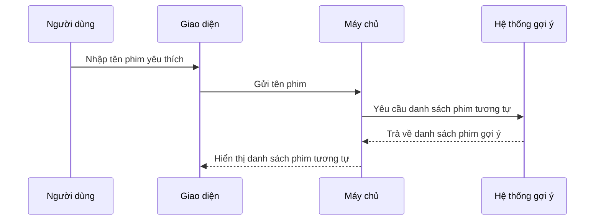
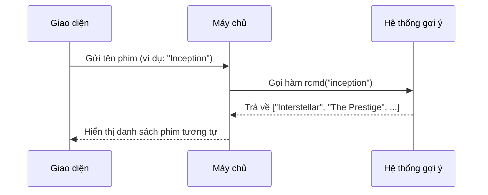

# Chapter 4: Hệ thống gợi ý phim (Movie Recommendation System)


## Chuyển tiếp từ chương trước

Ở [Chương 3: Quản lý Flask routes và luồng hoạt động (Luồng hoạt động Flask)](03_quản_lý_flask_routes_và_luồng_hoạt_động__luồng_hoạt_động_flask__.md), bạn đã biết cách máy chủ Flask nhận và xử lý các yêu cầu từ giao diện người dùng. Nhưng làm sao để khi bạn nhập tên một bộ phim, hệ thống có thể "hiểu" và gợi ý ra những bộ phim tương tự mà bạn có thể thích? Đó chính là nhiệm vụ của **hệ thống gợi ý phim** – bộ não của ứng dụng `netflix-rec`!

---

## Động lực: Tại sao cần hệ thống gợi ý phim?

Hãy tưởng tượng bạn vừa xem xong "Inception" và rất thích thể loại phim này. Bạn muốn tìm thêm những bộ phim tương tự để xem tiếp. Nếu phải tự tìm kiếm từng phim một, sẽ rất mất thời gian và có thể bỏ lỡ nhiều bộ phim hay.

**Hệ thống gợi ý phim** sẽ giúp bạn:  
- Chỉ cần nhập tên một bộ phim bạn thích, hệ thống sẽ ngay lập tức đề xuất ra danh sách những phim tương tự về thể loại, nội dung, hoặc phong cách.
- Trải nghiệm giống như có một người bạn am hiểu điện ảnh luôn sẵn sàng tư vấn cho bạn.

---

## Các khái niệm chính trong hệ thống gợi ý phim

Để xây dựng được hệ thống này, chúng ta cần hiểu một số khái niệm cơ bản:

### 1. Xử lý ngôn ngữ tự nhiên (NLP)

- Hệ thống cần "hiểu" nội dung, thể loại, diễn viên, đạo diễn... của từng bộ phim.
- Sử dụng kỹ thuật xử lý ngôn ngữ tự nhiên để biến các thông tin này thành dạng số mà máy tính có thể so sánh.

### 2. Độ tương đồng giữa các phim

- Hệ thống sẽ tính toán mức độ giống nhau giữa các bộ phim dựa trên các đặc điểm đã phân tích.
- Phim nào càng giống với phim bạn nhập, sẽ được ưu tiên gợi ý lên đầu.

### 3. Ma trận tương đồng (Similarity Matrix)

- Đây là một bảng lớn, trong đó mỗi ô thể hiện mức độ tương đồng giữa hai bộ phim bất kỳ.
- Khi bạn nhập tên phim, hệ thống chỉ cần tra cứu bảng này để tìm ra các phim gần giống nhất.

---

## Quy trình gợi ý phim: Từng bước đơn giản

Hãy cùng xem quy trình gợi ý phim diễn ra như thế nào khi bạn nhập tên một bộ phim:



**Giải thích:**  
- Bạn nhập tên phim, hệ thống sẽ xử lý và trả về danh sách các phim tương tự chỉ trong vài giây.

---

## Cách sử dụng hệ thống gợi ý phim trong dự án

### 1. Giao diện người dùng

Bạn chỉ cần nhập tên phim vào ô tìm kiếm và nhấn nút.  
**Ví dụ:**  
- Nhập: `Inception`
- Hệ thống sẽ gợi ý: `Interstellar`, `The Prestige`, `Shutter Island`,...

### 2. Gửi yêu cầu lên máy chủ

Khi bạn nhấn nút tìm kiếm, giao diện sẽ gửi tên phim lên máy chủ thông qua AJAX (đã học ở [Chương 2](02_xử_lý_yêu_cầu_ajax_và_hiển_thị_kết_quả__ajax___hiển_thị_kết_quả__.md)).

### 3. Máy chủ gọi hệ thống gợi ý

Máy chủ nhận tên phim và gọi hàm gợi ý phim để lấy danh sách các phim tương tự.

---

## Ví dụ mã nguồn: Hàm gợi ý phim

Dưới đây là phiên bản đơn giản của hàm gợi ý phim trong file `main.py`:

```python
def rcmd(m):
    m = m.lower()
    # Kiểm tra dữ liệu và ma trận tương đồng đã được tạo chưa
    try:
        data.head()
        similarity.shape
    except:
        data, similarity = create_similarity()
    # Nếu tên phim không có trong dữ liệu
    if m not in data['movie_title'].unique():
        return('Xin lỗi! Hãy thử tên phim khác')
    else:
        # Tìm vị trí phim trong dữ liệu
        i = data.loc[data['movie_title']==m].index[0]
        # Lấy danh sách điểm tương đồng với các phim khác
        lst = list(enumerate(similarity[i]))
        # Sắp xếp giảm dần theo độ tương đồng
        lst = sorted(lst, key = lambda x:x[1] ,reverse=True)
        # Bỏ qua phim gốc, lấy 10 phim tương tự nhất
        lst = lst[1:11]
        l = []
        for i in range(len(lst)):
            a = lst[i][0]
            l.append(data['movie_title'][a])
        return l
```

**Giải thích từng bước:**
- Chuyển tên phim về chữ thường để dễ so sánh.
- Nếu tên phim không có trong dữ liệu, trả về thông báo lỗi.
- Nếu có, tìm vị trí phim đó và tính toán độ tương đồng với các phim khác.
- Sắp xếp và chọn ra 10 phim tương tự nhất để gợi ý.

---

## Bên trong: Hệ thống gợi ý hoạt động như thế nào?

### 1. Tạo ma trận tương đồng

Khi khởi động, hệ thống sẽ đọc dữ liệu phim và tạo một ma trận thể hiện mức độ giống nhau giữa các phim.

```python
def create_similarity():
    data = pd.read_csv('main_data.csv')
    # Tạo ma trận đếm từ các đặc điểm phim
    cv = CountVectorizer()
    count_matrix = cv.fit_transform(data['comb'])
    # Tính toán ma trận tương đồng cosine
    similarity = cosine_similarity(count_matrix)
    return data, similarity
```

**Giải thích:**  
- Đọc dữ liệu phim từ file.
- Sử dụng CountVectorizer để biến các đặc điểm phim thành dạng số.
- Tính toán độ tương đồng giữa các phim bằng cosine similarity.

---

### 2. Quy trình khi người dùng nhập tên phim

- Nhận tên phim từ giao diện.
- Kiểm tra tên phim có trong dữ liệu không.
- Nếu có, tìm các phim tương tự nhất dựa trên ma trận tương đồng.
- Trả về danh sách phim gợi ý cho giao diện.

---

## Minh họa quy trình nội bộ



---

## Một số lưu ý khi sử dụng hệ thống gợi ý

- Tên phim cần nhập đúng (hoặc gần đúng) với dữ liệu có sẵn.
- Nếu không tìm thấy phim, hệ thống sẽ trả về thông báo lỗi.
- Danh sách phim gợi ý sẽ thay đổi tùy theo phim bạn nhập.

---

## Kết nối với các thành phần khác

- **Giao diện và AJAX** ([Chương 1](01_giao_diện_người_dùng_và_tự_động_hoàn_thành__giao_diện___autocomplete__.md) & [Chương 2](02_xử_lý_yêu_cầu_ajax_và_hiển_thị_kết_quả__ajax___hiển_thị_kết_quả__.md)): Nhận tên phim từ người dùng và gửi lên máy chủ.
- **Flask routes** ([Chương 3](03_quản_lý_flask_routes_và_luồng_hoạt_động__luồng_hoạt_động_flask__.md)): Nhận yêu cầu và chuyển đến hệ thống gợi ý.
- **Hệ thống gợi ý phim** (chương này): Xử lý và trả về danh sách phim tương tự.

---

## Tổng kết

Qua chương này, bạn đã hiểu:

- Hệ thống gợi ý phim là bộ não giúp ứng dụng đề xuất các bộ phim tương tự dựa trên tên phim bạn nhập.
- Quy trình hoạt động từ giao diện đến máy chủ và hệ thống gợi ý.
- Cách hệ thống tính toán độ tương đồng giữa các phim để đưa ra gợi ý phù hợp.

Ở chương tiếp theo, bạn sẽ tìm hiểu cách **xử lý dữ liệu đầu vào và chuyển đổi định dạng** để hệ thống hoạt động trơn tru hơn. Hãy tiếp tục khám phá tại:  
[Chương 5: Xử lý dữ liệu đầu vào và chuyển đổi định dạng (Chuyển đổi dữ liệu)](05_xử_lý_dữ_liệu_đầu_vào_và_chuyển_đổi_định_dạng__chuyển_đổi_dữ_liệu__.md)

