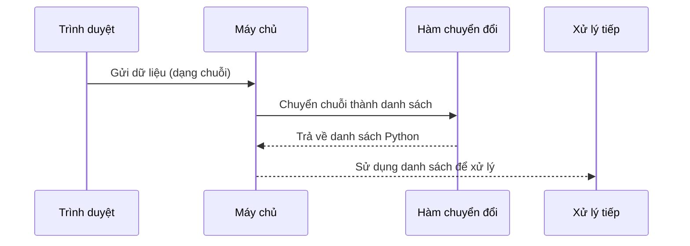

# Chapter 5: Xử lý dữ liệu đầu vào và chuyển đổi định dạng (Chuyển đổi dữ liệu)


## Chuyển tiếp từ chương trước

Ở [Chương 4: Hệ thống gợi ý phim (Movie Recommendation System)](04_hệ_thống_gợi_ý_phim__movie_recommendation_system__.md), bạn đã biết cách hệ thống gợi ý phim hoạt động để đề xuất những bộ phim tương tự dựa trên tên phim bạn nhập. Tuy nhiên, khi dữ liệu được gửi từ phía giao diện (client) lên máy chủ (server), dữ liệu này thường ở dạng chuỗi (string) hoặc JSON, không phải là các danh sách (list) mà Python có thể xử lý ngay. Vì vậy, chúng ta cần một bước trung gian để **chuyển đổi dữ liệu** về đúng định dạng trước khi tiếp tục xử lý.

---

## Động lực: Tại sao phải chuyển đổi dữ liệu đầu vào?

Hãy tưởng tượng bạn nhận được một danh sách các bộ phim từ trình duyệt, nhưng danh sách này lại được gửi dưới dạng một chuỗi như sau:

```
["Inception","Interstellar","Titanic"]
```

Nếu bạn muốn lấy từng tên phim để hiển thị hoặc xử lý tiếp, bạn không thể thao tác trực tiếp trên chuỗi này như một danh sách Python. Bạn cần **chuyển đổi** nó thành một danh sách thực sự:

```python
["Inception", "Interstellar", "Titanic"]
```

Nếu không chuyển đổi, mọi thao tác như lặp qua từng phim, lấy thông tin chi tiết... đều sẽ gặp lỗi hoặc không thực hiện được.

---

## Các khái niệm chính về chuyển đổi dữ liệu

### 1. Dữ liệu từ client thường ở dạng chuỗi

Khi bạn gửi dữ liệu từ trình duyệt (ví dụ: qua AJAX), dữ liệu thường được đóng gói thành chuỗi (string) hoặc JSON.

**Ví dụ:**  
- Chuỗi: `["A","B","C"]`
- Chuỗi số: `[1,2,3]`

### 2. Python cần dữ liệu dạng danh sách (list) để xử lý

Để thao tác dễ dàng (lặp, truy xuất, cập nhật...), Python cần dữ liệu ở dạng danh sách thực sự.

### 3. Hàm chuyển đổi dữ liệu

Chúng ta cần một hàm để chuyển đổi từ chuỗi sang danh sách Python.

---

## Cách sử dụng chuyển đổi dữ liệu trong dự án

### Tình huống thực tế

Khi người dùng chọn một bộ phim, hệ thống sẽ gửi nhiều thông tin lên máy chủ, trong đó có các trường như:

- `rec_movies`: Danh sách phim gợi ý (dạng chuỗi)
- `rec_posters`: Danh sách poster phim (dạng chuỗi)
- `cast_names`: Danh sách tên diễn viên (dạng chuỗi)
- ...

Để xử lý tiếp, ta cần chuyển đổi các trường này thành danh sách.

---

### Ví dụ: Chuyển đổi chuỗi thành danh sách

Giả sử bạn nhận được chuỗi sau từ client:

```python
my_list = '["Inception","Interstellar","Titanic"]'
```

Bạn muốn chuyển thành:

```python
["Inception", "Interstellar", "Titanic"]
```

#### Hàm chuyển đổi đơn giản

```python
def convert_to_list(my_list):
    my_list = my_list.split('","')
    my_list[0] = my_list[0].replace('["','')
    my_list[-1] = my_list[-1].replace('"]','')
    return my_list
```

**Giải thích:**  
- Hàm này cắt chuỗi thành các phần tử nhỏ dựa trên dấu `","`.
- Loại bỏ ký tự thừa ở đầu và cuối chuỗi.
- Trả về một danh sách Python thực sự.

---

### Ví dụ sử dụng hàm chuyển đổi

```python
chuoi = '["A","B","C"]'
danh_sach = convert_to_list(chuoi)
print(danh_sach)
```

**Kết quả:**  
```
['A', 'B', 'C']
```

**Giải thích:**  
- Sau khi chuyển đổi, bạn có thể dễ dàng lặp qua từng phần tử hoặc xử lý tiếp.

---

### Chuyển đổi chuỗi số thành danh sách số

Đôi khi bạn nhận được chuỗi như sau:

```python
cast_ids = "[1,2,3]"
```

Bạn muốn chuyển thành:

```python
["1", "2", "3"]
```

#### Cách chuyển đổi:

```python
cast_ids = cast_ids.split(',')
cast_ids[0] = cast_ids[0].replace("[","")
cast_ids[-1] = cast_ids[-1].replace("]","")
```

**Giải thích:**  
- Tách chuỗi thành các phần tử dựa trên dấu phẩy.
- Loại bỏ dấu ngoặc vuông ở đầu và cuối.
- Kết quả là một danh sách các chuỗi số.

---

## Quy trình bên trong khi chuyển đổi dữ liệu

Hãy xem quy trình này qua sơ đồ đơn giản:



**Giải thích:**  
- Trình duyệt gửi dữ liệu lên máy chủ dưới dạng chuỗi.
- Máy chủ gọi hàm chuyển đổi để biến chuỗi thành danh sách.
- Sau đó, máy chủ có thể dễ dàng xử lý dữ liệu.

---

## Bên trong mã nguồn: Xử lý dữ liệu đầu vào ở file `main.py`

Khi nhận dữ liệu từ AJAX ở route `/recommend`, máy chủ sẽ thực hiện các bước sau:

### 1. Nhận dữ liệu từ client

```python
rec_movies = request.form['rec_movies']
```

**Giải thích:**  
- Dữ liệu nhận được là một chuỗi (string).

---

### 2. Chuyển đổi chuỗi thành danh sách

```python
rec_movies = convert_to_list(rec_movies)
```

**Giải thích:**  
- Gọi hàm `convert_to_list` để chuyển đổi chuỗi thành danh sách.

---

### 3. Xử lý các trường khác tương tự

```python
cast_names = convert_to_list(cast_names)
cast_chars = convert_to_list(cast_chars)
# ...
```

**Giải thích:**  
- Các trường dữ liệu khác cũng được chuyển đổi tương tự để thuận tiện cho việc xử lý tiếp theo.

---

### 4. Đối với chuỗi số (ID), chuyển đổi như sau

```python
cast_ids = cast_ids.split(',')
cast_ids[0] = cast_ids[0].replace("[","")
cast_ids[-1] = cast_ids[-1].replace("]","")
```

**Giải thích:**  
- Tách chuỗi số thành danh sách các phần tử.

---

## Tổng kết quy trình chuyển đổi dữ liệu

1. **Nhận dữ liệu từ client** (dạng chuỗi).
2. **Chuyển đổi chuỗi thành danh sách** bằng các hàm chuyển đổi.
3. **Sử dụng danh sách** để xử lý tiếp (lặp, hiển thị, tính toán...).

---

## Một số lưu ý khi chuyển đổi dữ liệu

- Nếu dữ liệu là chuỗi JSON phức tạp, có thể sử dụng thư viện `json.loads()` để chuyển đổi.
- Luôn kiểm tra kỹ dữ liệu đầu vào để tránh lỗi khi chuyển đổi.
- Việc chuyển đổi đúng định dạng giúp các bước xử lý sau trở nên dễ dàng và an toàn hơn.

---

## Kết luận

Qua chương này, bạn đã hiểu:

- Tại sao cần chuyển đổi dữ liệu đầu vào từ chuỗi sang danh sách trong Python.
- Cách sử dụng các hàm chuyển đổi đơn giản để xử lý dữ liệu từ client.
- Quy trình bên trong khi dữ liệu đi từ trình duyệt đến máy chủ và được chuyển đổi để xử lý tiếp.

Ở chương tiếp theo, bạn sẽ tìm hiểu cách **tính toán độ tương đồng giữa các phim** để hệ thống gợi ý hoạt động chính xác hơn. Hãy tiếp tục khám phá tại:  
[Chương 6: Tính toán độ tương đồng giữa các phim (Tính toán Similarity)](06_tính_toán_độ_tương_đồng_giữa_các_phim__tính_toán_similarity__.md)

