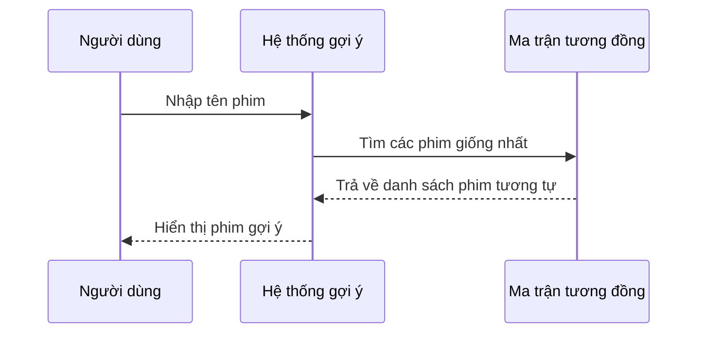

# Chapter 6: Tính toán độ tương đồng giữa các phim (Tính toán Similarity)


## Chuyển tiếp từ chương trước

Ở [Chương 5: Xử lý dữ liệu đầu vào và chuyển đổi định dạng (Chuyển đổi dữ liệu)](05_xử_lý_dữ_liệu_đầu_vào_và_chuyển_đổi_định_dạng__chuyển_đổi_dữ_liệu__.md), bạn đã học cách chuyển đổi dữ liệu từ dạng chuỗi sang danh sách để dễ dàng xử lý trong Python. Bây giờ, chúng ta sẽ tìm hiểu một bước cực kỳ quan trọng giúp hệ thống gợi ý phim hoạt động thông minh: **Tính toán độ tương đồng giữa các phim**.

---

## Động lực: Tại sao cần tính toán độ tương đồng giữa các phim?

Hãy tưởng tượng bạn vừa xem xong bộ phim "Inception" và muốn tìm thêm những bộ phim có nội dung, thể loại hoặc diễn viên tương tự. Làm sao để máy tính biết được "Interstellar" hay "The Prestige" là những phim giống "Inception"?

Đó chính là nhờ **tính toán độ tương đồng**! Hệ thống sẽ phân tích các đặc điểm của từng bộ phim (thể loại, diễn viên, nội dung, v.v.), sau đó so sánh để xem hai bộ phim giống nhau đến mức nào. Những phim càng giống nhau sẽ được gợi ý cho bạn.

---

## Các khái niệm cơ bản về độ tương đồng phim

### 1. Đặc điểm của phim là gì?

Mỗi bộ phim có nhiều thông tin như:
- Thể loại (ví dụ: khoa học viễn tưởng, hành động, lãng mạn)
- Diễn viên chính
- Đạo diễn
- Nội dung tóm tắt

Hệ thống sẽ kết hợp các thông tin này thành một chuỗi đặc điểm duy nhất cho mỗi phim.

### 2. Biến đặc điểm thành số (Vector hóa)

Máy tính không hiểu chữ, nên ta cần chuyển các đặc điểm phim thành dạng số.  
Công cụ phổ biến là **CountVectorizer** – nó sẽ đếm số lần xuất hiện của từng từ trong đặc điểm phim.

### 3. Độ tương đồng cosine (Cosine Similarity)

Sau khi đã có các vector số, ta sẽ dùng **cosine similarity** để đo mức độ giống nhau giữa hai phim.  
Giá trị càng gần 1 thì hai phim càng giống nhau, càng gần 0 thì càng khác nhau.

---

## Quy trình tính toán độ tương đồng giữa các phim

Hãy cùng xem quy trình này qua một ví dụ đơn giản:

1. **Ghép đặc điểm phim**: Kết hợp thể loại, diễn viên, đạo diễn, nội dung thành một chuỗi.
2. **Vector hóa**: Dùng CountVectorizer để biến chuỗi thành vector số.
3. **Tính toán độ tương đồng**: Dùng cosine similarity để so sánh các vector, tạo ra một ma trận thể hiện mức độ giống nhau giữa các phim.

---

## Ví dụ minh họa

Giả sử bạn có 3 bộ phim với đặc điểm như sau:

| Tên phim      | Đặc điểm kết hợp                                   |
|---------------|----------------------------------------------------|
| Inception     | khoa học viễn tưởng hành động Leonardo DiCaprio    |
| Interstellar  | khoa học viễn tưởng Matthew McConaughey            |
| Titanic       | lãng mạn Leonardo DiCaprio                         |

**Bước 1:** Ghép đặc điểm thành chuỗi (đã có ở cột "Đặc điểm kết hợp").

**Bước 2:** Vector hóa bằng CountVectorizer.

**Bước 3:** Tính toán độ tương đồng cosine giữa các phim.

Kết quả:  
- "Inception" và "Interstellar" có điểm tương đồng cao vì cùng thể loại.
- "Inception" và "Titanic" cũng có điểm tương đồng vì cùng diễn viên.

---

## Cách sử dụng trong dự án

### Đoạn mã tạo ma trận độ tương đồng

```python
from sklearn.feature_extraction.text import CountVectorizer
from sklearn.metrics.pairwise import cosine_similarity

cv = CountVectorizer()
count_matrix = cv.fit_transform(data['comb'])
similarity = cosine_similarity(count_matrix)
```

**Giải thích:**  
- `CountVectorizer()` biến đặc điểm phim thành vector số.
- `fit_transform()` áp dụng lên cột đặc điểm đã ghép (`data['comb']`).
- `cosine_similarity()` tính toán mức độ giống nhau giữa các phim, tạo ra một ma trận.

---

### Lấy danh sách các phim tương tự

Khi bạn nhập tên một bộ phim, hệ thống sẽ:

1. Tìm vị trí phim đó trong dữ liệu.
2. Lấy dòng tương ứng trong ma trận độ tương đồng.
3. Sắp xếp các phim theo điểm số từ cao đến thấp (bỏ qua chính phim đó).
4. Chọn ra 10 phim giống nhất để gợi ý.

```python
i = data.loc[data['movie_title']==m].index[0]
lst = list(enumerate(similarity[i]))
lst = sorted(lst, key = lambda x:x[1], reverse=True)
lst = lst[1:11]  # Bỏ qua phim gốc, lấy 10 phim tương tự nhất
```

**Giải thích:**  
- `i` là vị trí phim bạn nhập.
- `similarity[i]` là danh sách điểm tương đồng với các phim khác.
- Sắp xếp và chọn ra các phim có điểm cao nhất.

---

## Minh họa quy trình bên trong

Hãy xem sơ đồ đơn giản sau:



**Giải thích:**  
- Người dùng nhập tên phim.
- Hệ thống tra cứu trong ma trận độ tương đồng.
- Trả về danh sách phim giống nhất để gợi ý.

---

## Bên trong mã nguồn: Hàm tạo ma trận độ tương đồng

Trong file `main.py`, hàm `create_similarity()` thực hiện các bước sau:

```python
def create_similarity():
    data = pd.read_csv('main_data.csv')
    cv = CountVectorizer()
    count_matrix = cv.fit_transform(data['comb'])
    similarity = cosine_similarity(count_matrix)
    return data, similarity
```

**Giải thích từng dòng:**
- Đọc dữ liệu phim từ file CSV.
- Tạo CountVectorizer để biến đặc điểm thành vector số.
- Tính toán ma trận độ tương đồng cosine.
- Trả về dữ liệu và ma trận độ tương đồng.

---

## Tóm tắt quy trình khi người dùng nhập tên phim

1. **Nhận tên phim** từ người dùng.
2. **Kiểm tra** tên phim có trong dữ liệu không.
3. **Tìm vị trí** phim trong dữ liệu.
4. **Lấy dòng tương ứng** trong ma trận độ tương đồng.
5. **Sắp xếp và chọn** các phim có điểm cao nhất.
6. **Trả về danh sách phim gợi ý** cho người dùng.

---

## Một số lưu ý cho người mới bắt đầu

- Độ tương đồng càng cao thì hai phim càng giống nhau về đặc điểm.
- Ma trận độ tương đồng chỉ cần tính toán một lần khi khởi động hệ thống, sau đó có thể tái sử dụng.
- Nếu thêm phim mới vào dữ liệu, cần tạo lại ma trận độ tương đồng.

---

## Kết nối với các chương khác

- **Dữ liệu đầu vào** đã được chuyển đổi đúng định dạng ở [Chương 5](05_xử_lý_dữ_liệu_đầu_vào_và_chuyển_đổi_định_dạng__chuyển_đổi_dữ_liệu__.md).
- **Hệ thống gợi ý phim** sử dụng ma trận độ tương đồng này để đưa ra đề xuất (đã học ở [Chương 4](04_hệ_thống_gợi_ý_phim__movie_recommendation_system__.md)).
- **Giao diện và AJAX** sẽ hiển thị kết quả cho người dùng (xem lại [Chương 1](01_giao_diện_người_dùng_và_tự_động_hoàn_thành__giao_diện___autocomplete__.md) và [Chương 2](02_xử_lý_yêu_cầu_ajax_và_hiển_thị_kết_quả__ajax___hiển_thị_kết_quả__.md)).

---

## Tổng kết

Qua chương này, bạn đã hiểu:

- Tại sao cần tính toán độ tương đồng giữa các phim để gợi ý chính xác.
- Các bước cơ bản: ghép đặc điểm, vector hóa, tính toán cosine similarity.
- Cách hệ thống sử dụng ma trận độ tương đồng để tìm ra các phim giống nhau nhất.

Ở chương tiếp theo, bạn sẽ học cách **tích hợp API phim** để lấy thêm thông tin chi tiết từ các nguồn như TMDB và IMDB, giúp hệ thống gợi ý phong phú hơn. Hãy tiếp tục khám phá tại:  
[Chương 7: Tích hợp API phim (Kết nối API TMDB & IMDB)](07_tích_hợp_api_phim__kết_nối_api_tmdb___imdb__.md)

