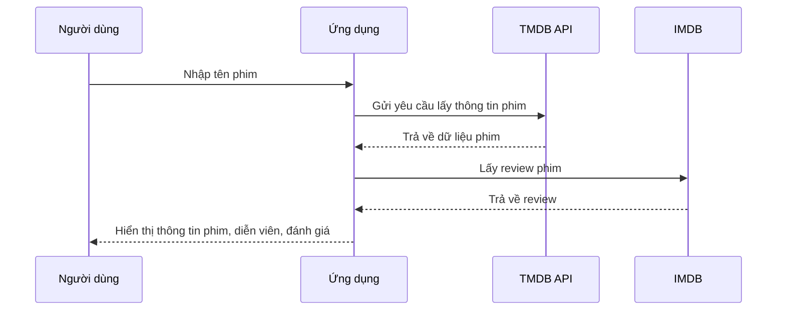

# Chapter 7: Tích hợp API phim (Kết nối API TMDB & IMDB)


## Chuyển tiếp từ chương trước

Ở [Chương 6: Tính toán độ tương đồng giữa các phim (Tính toán Similarity)](06_tính_toán_độ_tương_đồng_giữa_các_phim__tính_toán_similarity__.md), bạn đã biết cách hệ thống so sánh các bộ phim để đưa ra gợi ý phù hợp. Tuy nhiên, để ứng dụng luôn có thông tin phim mới nhất, hình ảnh đẹp, diễn viên, đánh giá... thì chỉ dựa vào dữ liệu có sẵn là chưa đủ. Đây là lúc **tích hợp API phim** phát huy sức mạnh!

---

## Động lực: Tại sao cần tích hợp API phim?

Hãy tưởng tượng bạn muốn xem thông tin chi tiết về bộ phim "Inception": poster, diễn viên, điểm đánh giá, ngày phát hành... Nếu bạn tự xây dựng và cập nhật cơ sở dữ liệu, công việc sẽ rất vất vả và dễ lỗi thời.

**Giải pháp:**  
Sử dụng các API phim như **TMDB** (The Movie Database) và **IMDB** để lấy dữ liệu mới nhất, tự động và đầy đủ.  
Giống như bạn hỏi một thư viện phim khổng lồ trên mạng, chỉ cần gửi yêu cầu là nhận được thông tin mong muốn!

---

## Các khái niệm chính về API phim

### 1. API là gì?

- **API** (Application Programming Interface) là một cổng giao tiếp cho phép ứng dụng của bạn "nói chuyện" với các hệ thống khác để lấy dữ liệu.
- Ở đây, API của TMDB và IMDB cung cấp thông tin phim, diễn viên, poster, đánh giá...

### 2. TMDB và IMDB là gì?

- **TMDB**: The Movie Database – một kho dữ liệu phim lớn, miễn phí, có API mạnh mẽ.
- **IMDB**: Internet Movie Database – kho dữ liệu phim nổi tiếng, chủ yếu dùng để lấy đánh giá, review.

### 3. Lợi ích khi dùng API phim

- **Luôn cập nhật**: Thông tin phim mới sẽ tự động có mặt.
- **Đầy đủ**: Có poster, diễn viên, trailer, đánh giá, ngày phát hành...
- **Tiết kiệm công sức**: Không cần tự nhập liệu thủ công.

---

## Quy trình sử dụng API phim trong dự án

### Tình huống thực tế

Bạn nhập tên phim "Inception" vào ứng dụng. Hệ thống sẽ:

1. Gửi yêu cầu đến API TMDB để lấy thông tin phim (poster, diễn viên, điểm đánh giá...).
2. Lấy thêm đánh giá người dùng từ IMDB.
3. Hiển thị tất cả thông tin này lên giao diện cho bạn.

---

### Ví dụ: Lấy thông tin phim từ TMDB

#### Bước 1: Gửi yêu cầu lấy thông tin phim

```js
$.ajax({
  type: 'GET',
  url: 'https://api.themoviedb.org/3/search/movie?api_key=' + my_api_key + '&query=' + title,
  success: function(movie) {
    // Xử lý kết quả ở đây
  }
});
```

**Giải thích:**  
- Gửi yêu cầu GET đến API TMDB với tên phim bạn nhập.
- Nếu thành công, nhận được dữ liệu phim (poster, id, tiêu đề...).

---

#### Bước 2: Lấy chi tiết phim bằng ID

```js
$.ajax({
  type: 'GET',
  url: 'https://api.themoviedb.org/3/movie/' + movie_id + '?api_key=' + my_api_key,
  success: function(movie_details) {
    // Xử lý chi tiết phim ở đây
  }
});
```

**Giải thích:**  
- Dùng ID phim vừa lấy được để hỏi thêm chi tiết (poster, điểm đánh giá, ngày phát hành...).

---

#### Bước 3: Lấy danh sách diễn viên

```js
$.ajax({
  type: 'GET',
  url: 'https://api.themoviedb.org/3/movie/' + movie_id + '/credits?api_key=' + my_api_key,
  success: function(my_movie) {
    // Lấy danh sách diễn viên chính
  }
});
```

**Giải thích:**  
- Lấy danh sách diễn viên, vai diễn, hình ảnh diễn viên...

---

#### Bước 4: Lấy review từ IMDB

Trong file Python, dùng web scraping để lấy review từ IMDB:

```python
sauce = urllib.request.urlopen('https://www.imdb.com/title/{}/reviews?ref_=tt_ov_rt'.format(imdb_id)).read()
soup = bs.BeautifulSoup(sauce,'lxml')
soup_result = soup.find_all("div",{"class":"text show-more__control"})
```

**Giải thích:**  
- Lấy mã IMDB của phim, truy cập trang review, lấy các đánh giá của người dùng.

---

## Minh họa quy trình tích hợp API phim



**Giải thích:**  
- Ứng dụng đóng vai trò trung gian, hỏi TMDB và IMDB rồi tổng hợp thông tin cho bạn.

---

## Bên trong mã nguồn: Cách tích hợp API phim

### 1. Lấy thông tin phim từ TMDB (file `static/recommend.js`)

```js
$.ajax({
  type: 'GET',
  url: 'https://api.themoviedb.org/3/search/movie?api_key=' + my_api_key + '&query=' + title,
  success: function(movie) {
    // Lấy movie_id và các thông tin cơ bản
  }
});
```

**Giải thích:**  
- Gửi yêu cầu đến TMDB để tìm phim theo tên.

---

### 2. Lấy chi tiết phim (poster, điểm đánh giá, ngày phát hành...)

```js
$.ajax({
  type: 'GET',
  url: 'https://api.themoviedb.org/3/movie/' + movie_id + '?api_key=' + my_api_key,
  success: function(movie_details) {
    // Lấy poster, overview, rating, release_date...
  }
});
```

**Giải thích:**  
- Lấy các thông tin chi tiết để hiển thị lên giao diện.

---

### 3. Lấy danh sách diễn viên

```js
$.ajax({
  type: 'GET',
  url: 'https://api.themoviedb.org/3/movie/' + movie_id + '/credits?api_key=' + my_api_key,
  success: function(my_movie) {
    // Lấy danh sách diễn viên chính
  }
});
```

**Giải thích:**  
- Lấy tên, vai diễn, hình ảnh diễn viên để hiển thị.

---

### 4. Lấy review từ IMDB (file `main.py`)

```python
sauce = urllib.request.urlopen('https://www.imdb.com/title/{}/reviews?ref_=tt_ov_rt'.format(imdb_id)).read()
soup = bs.BeautifulSoup(sauce,'lxml')
soup_result = soup.find_all("div",{"class":"text show-more__control"})
```

**Giải thích:**  
- Dùng Python để truy cập trang review của IMDB và lấy các đánh giá thực tế từ người dùng.

---

### 5. Tổng hợp và gửi dữ liệu về giao diện

Sau khi lấy đủ thông tin từ TMDB và IMDB, ứng dụng sẽ tổng hợp lại và gửi về giao diện để hiển thị cho người dùng.

---

## Quy trình bên trong khi người dùng tìm kiếm phim

1. **Người dùng** nhập tên phim và nhấn tìm kiếm.
2. **Ứng dụng** gửi yêu cầu đến TMDB để lấy thông tin phim.
3. **Ứng dụng** lấy thêm review từ IMDB.
4. **Ứng dụng** tổng hợp tất cả thông tin (poster, diễn viên, đánh giá, review...).
5. **Giao diện** hiển thị thông tin chi tiết cho người dùng.

---

## Một số lưu ý khi sử dụng API phim

- **Cần đăng ký tài khoản TMDB** để lấy `api_key` (miễn phí).
- **Giới hạn số lượng yêu cầu**: TMDB có giới hạn số lần gọi API mỗi ngày, nên tránh gửi quá nhiều yêu cầu không cần thiết.
- **Kiểm tra dữ liệu trả về**: Đôi khi phim không có đủ thông tin (ví dụ: thiếu poster hoặc diễn viên), cần xử lý trường hợp này để tránh lỗi giao diện.

---

## Kết nối với các chương khác

- **AJAX và giao diện** ([Chương 2](02_xử_lý_yêu_cầu_ajax_và_hiển_thị_kết_quả__ajax___hiển_thị_kết_quả__.md)): Gửi yêu cầu lấy thông tin phim.
- **Xử lý dữ liệu đầu vào** ([Chương 5](05_xử_lý_dữ_liệu_đầu_vào_và_chuyển_đổi_định_dạng__chuyển_đổi_dữ_liệu__.md)): Chuyển đổi dữ liệu từ API về dạng phù hợp.
- **Hiển thị chi tiết phim** sẽ được trình bày ở chương tiếp theo!

---

## Tổng kết

Qua chương này, bạn đã học:

- Tại sao nên tích hợp API phim như TMDB & IMDB vào ứng dụng.
- Cách gửi yêu cầu đến API để lấy thông tin phim, diễn viên, poster, đánh giá, review...
- Quy trình tổng hợp và hiển thị dữ liệu phim mới nhất cho người dùng.

Ở chương tiếp theo, bạn sẽ tìm hiểu **cách xử lý và hiển thị thông tin chi tiết phim** trên giao diện. Hãy tiếp tục khám phá tại:  
[Chương 8: Xử lý và hiển thị thông tin chi tiết phim (Chi tiết phim)](08_xử_lý_và_hiển_thị_thông_tin_chi_tiết_phim__chi_tiết_phim__.md)

