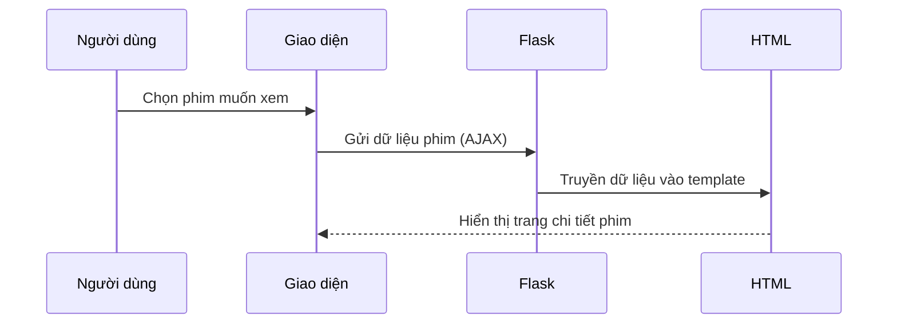

# Chapter 8: Xử lý và hiển thị thông tin chi tiết phim (Chi tiết phim)


## Chuyển tiếp từ chương trước

Ở [Chương 7: Tích hợp API phim (Kết nối API TMDB & IMDB)](07_tích_hợp_api_phim__kết_nối_api_tmdb___imdb__.md), bạn đã học cách lấy thông tin phim từ các nguồn dữ liệu lớn như TMDB và IMDB. Nhưng sau khi đã có dữ liệu, làm thế nào để **xử lý và hiển thị thông tin chi tiết của một bộ phim** thật đẹp mắt, đầy đủ và dễ hiểu cho người dùng? Đó chính là nội dung của chương này!

---

## Động lực: Tại sao cần xử lý và hiển thị thông tin chi tiết phim?

Hãy tưởng tượng bạn vừa tìm kiếm bộ phim "Inception" trên ứng dụng. Bạn muốn xem:

- Poster phim lớn, rõ nét
- Tóm tắt nội dung hấp dẫn
- Thể loại, điểm đánh giá, ngày phát hành, thời lượng, trạng thái
- Danh sách diễn viên chính
- Các phim liên quan để xem tiếp

Nếu chỉ hiển thị tên phim hoặc vài dòng chữ, trải nghiệm sẽ rất nhàm chán. Một **trang chi tiết phim** giống như một tấm danh thiếp, giúp bạn quyết định có nên xem phim này hay không!

---

## Các khái niệm chính khi hiển thị chi tiết phim

Để xây dựng trang chi tiết phim, chúng ta cần hiểu một số thành phần cơ bản:

### 1. Thông tin phim là gì?

- **Poster**: Ảnh đại diện lớn của phim
- **Tóm tắt nội dung**: Giới thiệu ngắn gọn về cốt truyện
- **Thể loại**: Ví dụ: Hành động, Khoa học viễn tưởng, Lãng mạn...
- **Điểm đánh giá**: Số điểm do người xem bình chọn (ví dụ: 8.8/10)
- **Ngày phát hành**: Khi nào phim ra mắt
- **Thời lượng**: Tổng thời gian phim (ví dụ: 2 giờ 28 phút)
- **Trạng thái**: Đã phát hành hay chưa
- **Các phim liên quan**: Gợi ý những phim tương tự

### 2. Dữ liệu diễn viên

- Tên diễn viên, vai diễn, hình ảnh, ngày sinh, nơi sinh, tiểu sử...

### 3. Dữ liệu phim liên quan

- Danh sách các phim được hệ thống gợi ý dựa trên độ tương đồng

---

## Cách sử dụng: Hiển thị chi tiết phim khi người dùng chọn

### Tình huống thực tế

Bạn nhập "Inception" và nhấn tìm kiếm. Sau vài giây, trang chi tiết hiện ra với đầy đủ thông tin:

- Ảnh poster lớn
- Tóm tắt nội dung
- Thể loại: Khoa học viễn tưởng, Hành động
- Điểm đánh giá: 8.8/10
- Ngày phát hành: 16 Jul 2010
- Thời lượng: 2 giờ 28 phút
- Trạng thái: Released
- Danh sách diễn viên chính (ảnh + tên + vai diễn)
- Các phim liên quan (có poster + tên phim)

### Ví dụ: Đầu vào và đầu ra

**Đầu vào:** Người dùng chọn phim "Inception"  
**Đầu ra:** Trang chi tiết phim với đầy đủ thông tin như trên

---

### Đoạn mã gửi dữ liệu lên server để hiển thị chi tiết phim

Khi đã lấy đủ thông tin từ API, ta gửi dữ liệu lên Flask để xử lý và hiển thị:

```js
$.ajax({
  type:'POST',
  data:details, // chứa tất cả thông tin phim
  url:"/recommend",
  dataType: 'html',
  success: function(response) {
    $('.results').html(response); // Hiển thị kết quả lên giao diện
  }
});
```

**Giải thích:**  
- Gửi toàn bộ thông tin phim lên server qua route `/recommend`
- Khi server trả về HTML, cập nhật giao diện để hiển thị chi tiết phim

---

### Đoạn mã xử lý dữ liệu và hiển thị ở Flask (`main.py`)

```python
@app.route("/recommend",methods=["POST"])
def recommend():
    title = request.form['title']
    poster = request.form['poster']
    overview = request.form['overview']
    # ... lấy các trường khác ...
    return render_template('recommend.html', title=title, poster=poster, overview=overview, ...)
```

**Giải thích:**  
- Nhận dữ liệu từ client (giao diện)
- Truyền dữ liệu vào file HTML để hiển thị

---

### Đoạn mã HTML hiển thị thông tin phim (ví dụ)

```html

<h2>{{ title }}</h2>
<p><b>Thể loại:</b> {{ genres }}</p>
<p><b>Điểm đánh giá:</b> {{ vote_average }}/10</p>
<p><b>Ngày phát hành:</b> {{ release_date }}</p>
<p><b>Thời lượng:</b> {{ runtime }}</p>
<p><b>Trạng thái:</b> {{ status }}</p>
<p><b>Tóm tắt:</b> {{ overview }}</p>
```

**Giải thích:**  
- Sử dụng các biến truyền từ Flask để hiển thị thông tin phim lên giao diện

---

### Hiển thị danh sách phim liên quan

```html
<h3>Phim liên quan</h3>
<ul>
  
    <li>
      
      <p>{{ name }}</p>
    </li>
  
</ul>
```

**Giải thích:**  
- Duyệt qua danh sách phim liên quan, hiển thị poster và tên phim

---

### Hiển thị danh sách diễn viên chính

```html
<h3>Diễn viên chính</h3>
<ul>
  
    <li>
      
      <p>{{ name }} (vai {{ info[1] }})</p>
    </li>
  
</ul>
```

**Giải thích:**  
- Duyệt qua danh sách diễn viên, hiển thị ảnh, tên và vai diễn

---

## Quy trình bên trong: Từ khi người dùng chọn phim đến khi hiển thị chi tiết

Hãy hình dung quy trình này qua sơ đồ sau:



**Giải thích:**  
- Người dùng chọn phim, giao diện gửi dữ liệu lên server
- Flask nhận dữ liệu, truyền vào file HTML
- HTML được trả về và hiển thị lên giao diện

---

## Bên trong mã nguồn: Các bước xử lý dữ liệu chi tiết phim

### 1. Nhận dữ liệu từ client

```python
title = request.form['title']
poster = request.form['poster']
overview = request.form['overview']
# ... các trường khác ...
```

**Giải thích:**  
- Lấy từng trường thông tin phim từ dữ liệu gửi lên

---

### 2. Chuyển đổi các trường dạng danh sách

```python
rec_movies = convert_to_list(rec_movies)
rec_posters = convert_to_list(rec_posters)
```

**Giải thích:**  
- Chuyển đổi các trường dạng chuỗi sang danh sách để dễ xử lý

---

### 3. Kết hợp dữ liệu thành dictionary để truyền vào HTML

```python
movie_cards = {rec_posters[i]: rec_movies[i] for i in range(len(rec_posters))}
```

**Giải thích:**  
- Ghép poster và tên phim liên quan thành cặp để dễ hiển thị

---

### 4. Trả về file HTML với đầy đủ dữ liệu

```python
return render_template('recommend.html', title=title, poster=poster, overview=overview, movie_cards=movie_cards, ...)
```

**Giải thích:**  
- Truyền tất cả dữ liệu vào file HTML để hiển thị

---

## Một số lưu ý khi hiển thị chi tiết phim

- **Kiểm tra dữ liệu**: Nếu thiếu poster hoặc thông tin, nên hiển thị ảnh/thông báo mặc định để tránh lỗi giao diện
- **Tối ưu trải nghiệm**: Sắp xếp thông tin rõ ràng, dễ đọc, dùng ảnh đẹp để thu hút người dùng
- **Tương tác**: Cho phép người dùng nhấn vào phim liên quan để xem tiếp chi tiết

---

## Kết nối với các chương khác

- **Lấy thông tin phim từ API**: [Chương 7: Tích hợp API phim (Kết nối API TMDB & IMDB)](07_tích_hợp_api_phim__kết_nối_api_tmdb___imdb__.md)
- **Xử lý dữ liệu đầu vào**: [Chương 5: Xử lý dữ liệu đầu vào và chuyển đổi định dạng (Chuyển đổi dữ liệu)](05_xử_lý_dữ_liệu_đầu_vào_và_chuyển_đổi_định_dạng__chuyển_đổi_dữ_liệu__.md)
- **Lấy thông tin diễn viên chi tiết** sẽ được trình bày ở chương tiếp theo!

---

## Tổng kết

Qua chương này, bạn đã học cách:

- Xử lý và hiển thị thông tin chi tiết phim một cách đầy đủ, đẹp mắt và thân thiện với người dùng
- Kết hợp nhiều nguồn dữ liệu (API, hệ thống gợi ý, dữ liệu diễn viên) để tạo nên một trang chi tiết phim hấp dẫn
- Hiểu quy trình từ khi người dùng chọn phim đến khi dữ liệu được xử lý và hiển thị

Ở chương tiếp theo, bạn sẽ tìm hiểu **cách lấy và xử lý thông tin diễn viên** để trang chi tiết phim càng thêm sinh động!  
Hãy tiếp tục với: [Chương 9: Lấy và xử lý thông tin diễn viên (Thông tin diễn viên)](09_lấy_và_xử_lý_thông_tin_diễn_viên__thông_tin_diễn_viên__.md)

