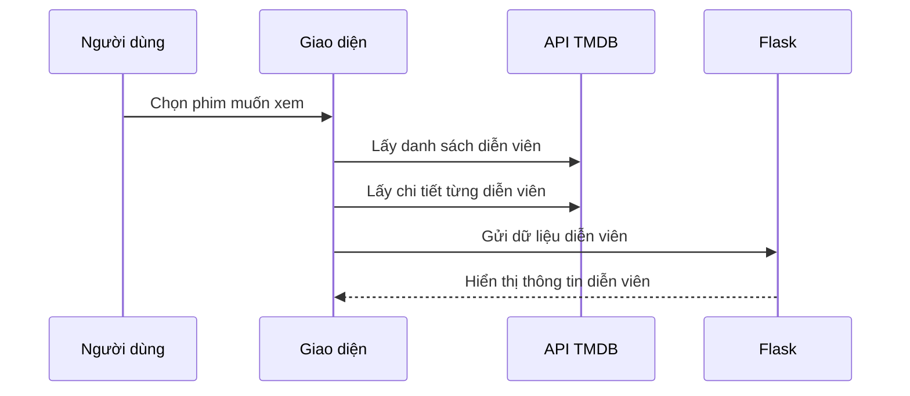

# Chapter 9: Lấy và xử lý thông tin diễn viên (Thông tin diễn viên)


## Chuyển tiếp từ chương trước

Ở [Chương 8: Xử lý và hiển thị thông tin chi tiết phim (Chi tiết phim)](08_xử_lý_và_hiển_thị_thông_tin_chi_tiết_phim__chi_tiết_phim__.md), bạn đã biết cách hiển thị đầy đủ thông tin về một bộ phim như poster, tóm tắt, điểm đánh giá, các phim liên quan... Tuy nhiên, một phần không thể thiếu giúp bộ phim trở nên hấp dẫn hơn chính là **dàn diễn viên**! Vậy làm sao để lấy và trình bày thông tin chi tiết về các diễn viên một cách sinh động và trực quan? Hãy cùng tìm hiểu trong chương này nhé!

---

## Động lực: Tại sao cần lấy và xử lý thông tin diễn viên?

Hãy tưởng tượng bạn vừa xem xong một bộ phim và rất ấn tượng với một diễn viên nào đó. Bạn muốn biết:

- Tên thật của diễn viên là gì?
- Họ đóng vai gì trong phim?
- Ngày sinh, nơi sinh, tiểu sử ra sao?
- Hình ảnh ngoài đời của họ như thế nào?

Nếu chỉ có tên diễn viên thì thật nhàm chán! Việc hiển thị đầy đủ thông tin như một "cuốn sổ tay điện ảnh" giúp bạn hiểu rõ hơn về dàn sao, từ đó tăng sự hứng thú khi xem phim và khám phá thêm các tác phẩm khác của họ.

---

## Các khái niệm chính khi lấy thông tin diễn viên

Để lấy và xử lý thông tin diễn viên, chúng ta cần hiểu một số khái niệm cơ bản sau:

### 1. Diễn viên chính là ai?

- **Diễn viên chính** là những người đảm nhận các vai quan trọng nhất trong phim, thường xuất hiện nhiều nhất và có ảnh hưởng lớn đến cốt truyện.

### 2. Thông tin cần lấy về diễn viên

- **Tên thật** (name)
- **Vai diễn trong phim** (character)
- **Ngày sinh** (birthday)
- **Nơi sinh** (place of birth)
- **Tiểu sử** (biography)
- **Hình ảnh** (profile picture)

### 3. Lấy thông tin diễn viên từ đâu?

- Sử dụng **API TMDB** để lấy thông tin chi tiết về diễn viên dựa trên ID của họ.
- Kết hợp với dữ liệu phim đã lấy ở các chương trước.

---

## Cách sử dụng: Lấy và hiển thị thông tin diễn viên cho một bộ phim

### Tình huống thực tế

Bạn chọn xem chi tiết phim "Inception". Ở phần "Diễn viên chính", bạn sẽ thấy:

- Ảnh đại diện của từng diễn viên
- Tên thật và vai diễn trong phim
- Ngày sinh, nơi sinh, tiểu sử ngắn gọn

**Đầu vào:** ID phim (ví dụ: "Inception")  
**Đầu ra:** Danh sách diễn viên chính với đầy đủ thông tin như trên

---

### Ví dụ mã JavaScript: Lấy danh sách diễn viên chính

```js
function get_movie_cast(movie_id, my_api_key){
  cast_ids = [];
  cast_names = [];
  cast_chars = [];
  cast_profiles = [];

  $.ajax({
    type:'GET',
    url:"https://api.themoviedb.org/3/movie/"+movie_id+"/credits?api_key="+my_api_key,
    async:false,
    success: function(my_movie){
      for(var i=0; i<5; i++){
        cast_ids.push(my_movie.cast[i].id);
        cast_names.push(my_movie.cast[i].name);
        cast_chars.push(my_movie.cast[i].character);
        cast_profiles.push("https://image.tmdb.org/t/p/original"+my_movie.cast[i].profile_path);
      }
    }
  });
  return {cast_ids:cast_ids, cast_names:cast_names, cast_chars:cast_chars, cast_profiles:cast_profiles};
}
```

**Giải thích:**  
- Hàm này lấy danh sách 5 diễn viên chính của phim từ API TMDB.
- Lưu lại ID, tên, vai diễn và ảnh đại diện của từng diễn viên.

---

### Ví dụ mã JavaScript: Lấy thông tin chi tiết từng diễn viên

```js
function get_individual_cast(movie_cast, my_api_key) {
  cast_bdays = [];
  cast_bios = [];
  cast_places = [];
  for(var i in movie_cast.cast_ids){
    $.ajax({
      type:'GET',
      url:'https://api.themoviedb.org/3/person/'+movie_cast.cast_ids[i]+'?api_key='+my_api_key,
      async:false,
      success: function(cast_details){
        cast_bdays.push(cast_details.birthday);
        cast_bios.push(cast_details.biography);
        cast_places.push(cast_details.place_of_birth);
      }
    });
  }
  return {cast_bdays:cast_bdays, cast_bios:cast_bios, cast_places:cast_places};
}
```

**Giải thích:**  
- Với mỗi ID diễn viên, gửi yêu cầu đến API TMDB để lấy ngày sinh, tiểu sử, nơi sinh.
- Kết quả trả về là các danh sách thông tin tương ứng với từng diễn viên.

---

### Kết hợp dữ liệu diễn viên để gửi về server

```js
details = {
  // ... các trường phim ...
  'cast_ids': JSON.stringify(movie_cast.cast_ids),
  'cast_names': JSON.stringify(movie_cast.cast_names),
  'cast_chars': JSON.stringify(movie_cast.cast_chars),
  'cast_profiles': JSON.stringify(movie_cast.cast_profiles),
  'cast_bdays': JSON.stringify(ind_cast.cast_bdays),
  'cast_bios': JSON.stringify(ind_cast.cast_bios),
  'cast_places': JSON.stringify(ind_cast.cast_places),
}
```

**Giải thích:**  
- Đóng gói tất cả thông tin diễn viên vào một object để gửi lên server Flask.

---

### Hiển thị thông tin diễn viên trên giao diện (HTML)

```html
<ul>
  
    <li>
      
      <p><b>{{ name }}</b> (vai {{ info[1] }})</p>
      <p>Ngày sinh: {{ info[3] }}</p>
      <p>Nơi sinh: {{ info[5] }}</p>
      <p>Tiểu sử: {{ info[4][:100] }}...</p>
    </li>
  
</ul>
```

**Giải thích:**  
- Duyệt qua từng diễn viên, hiển thị ảnh, tên, vai diễn, ngày sinh, nơi sinh, tiểu sử ngắn gọn.

---

## Quy trình bên trong: Từ khi người dùng chọn phim đến khi hiển thị thông tin diễn viên

Hãy hình dung quy trình này qua sơ đồ sau:



**Giải thích:**  
- Giao diện lấy thông tin diễn viên từ API TMDB, sau đó gửi về server để xử lý và hiển thị lên trang chi tiết phim.

---

## Bên trong mã nguồn: Xử lý dữ liệu diễn viên ở Flask

### 1. Nhận dữ liệu diễn viên từ client

```python
cast_names = request.form['cast_names']
cast_chars = request.form['cast_chars']
cast_profiles = request.form['cast_profiles']
cast_bdays = request.form['cast_bdays']
cast_bios = request.form['cast_bios']
cast_places = request.form['cast_places']
```

**Giải thích:**  
- Lấy các trường thông tin diễn viên từ dữ liệu gửi lên.

---

### 2. Chuyển đổi chuỗi sang danh sách

```python
def convert_to_list(my_list):
    my_list = my_list.split('","')
    my_list[0] = my_list[0].replace('["','')
    my_list[-1] = my_list[-1].replace('"]','')
    return my_list

cast_names = convert_to_list(cast_names)
cast_chars = convert_to_list(cast_chars)
cast_profiles = convert_to_list(cast_profiles)
cast_bdays = convert_to_list(cast_bdays)
cast_bios = convert_to_list(cast_bios)
cast_places = convert_to_list(cast_places)
```

**Giải thích:**  
- Chuyển đổi các trường từ dạng chuỗi JSON sang danh sách Python để dễ xử lý.

---

### 3. Kết hợp dữ liệu thành dictionary để truyền vào HTML

```python
casts = {}
for i in range(len(cast_names)):
    casts[cast_names[i]] = [cast_names[i], cast_chars[i], cast_profiles[i], cast_bdays[i], cast_bios[i], cast_places[i]]
```

**Giải thích:**  
- Ghép các thông tin lại thành một dictionary, mỗi diễn viên là một mục với đầy đủ thông tin.

---

### 4. Truyền dữ liệu vào file HTML

```python
return render_template('recommend.html', casts=casts, ...)
```

**Giải thích:**  
- Truyền dictionary `casts` vào file HTML để hiển thị danh sách diễn viên.

---

## Một số lưu ý khi lấy và hiển thị thông tin diễn viên

- **Kiểm tra dữ liệu trả về:** Đôi khi diễn viên không có đủ thông tin (ví dụ: thiếu ảnh hoặc tiểu sử), nên hiển thị thông báo hoặc ảnh mặc định.
- **Giới hạn số lượng diễn viên:** Chỉ nên hiển thị 5-10 diễn viên chính để giao diện gọn gàng, dễ nhìn.
- **Rút gọn tiểu sử:** Nếu tiểu sử quá dài, chỉ hiển thị đoạn đầu và cho phép xem thêm nếu cần.

---

## Kết nối với các chương khác

- **Lấy thông tin phim từ API:** [Chương 7: Tích hợp API phim (Kết nối API TMDB & IMDB)](07_tích_hợp_api_phim__kết_nối_api_tmdb___imdb__.md)
- **Hiển thị chi tiết phim:** [Chương 8: Xử lý và hiển thị thông tin chi tiết phim (Chi tiết phim)](08_xử_lý_và_hiển_thị_thông_tin_chi_tiết_phim__chi_tiết_phim__.md)
- **Phân tích cảm xúc đánh giá phim** sẽ được trình bày ở chương tiếp theo!

---

## Tổng kết

Qua chương này, bạn đã học cách:

- Lấy thông tin chi tiết về các diễn viên chính của phim từ API TMDB
- Xử lý và kết hợp các trường thông tin như tên, vai diễn, ngày sinh, nơi sinh, tiểu sử, hình ảnh
- Hiển thị danh sách diễn viên sinh động, trực quan trên giao diện người dùng

Nhờ đó, trang chi tiết phim của bạn sẽ trở nên hấp dẫn và chuyên nghiệp hơn, giúp người dùng dễ dàng khám phá thêm về các ngôi sao điện ảnh yêu thích!

Ở chương tiếp theo, bạn sẽ tìm hiểu **cách phân tích cảm xúc đánh giá phim** để hiểu rõ hơn về phản hồi của khán giả. Hãy tiếp tục với:  
[Chương 10: Phân tích cảm xúc đánh giá phim (Phân tích review)](10_phân_tích_cảm_xúc_đánh_giá_phim__phân_tích_review__.md)

