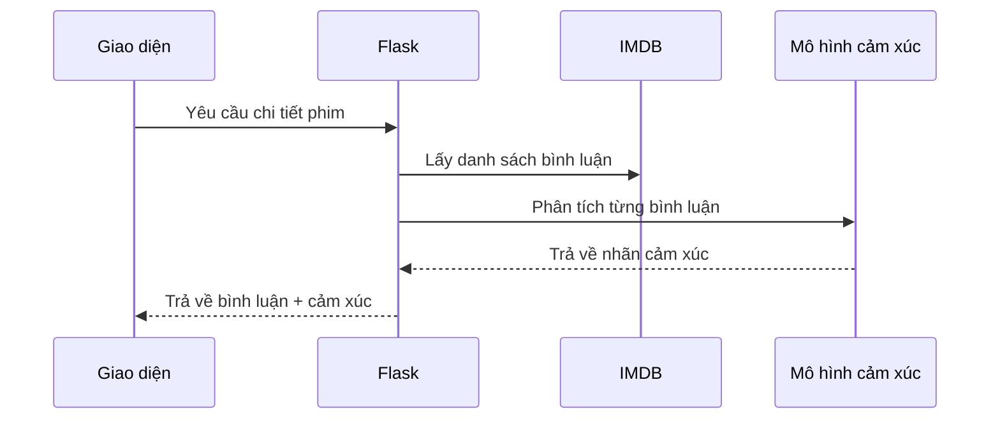

# Chapter 10: Phân tích cảm xúc đánh giá phim (Phân tích review)


## Chuyển tiếp từ chương trước

Ở [Chương 9: Lấy và xử lý thông tin diễn viên (Thông tin diễn viên)](09_lấy_và_xử_lý_thông_tin_diễn_viên__thông_tin_diễn_viên__.md), bạn đã biết cách lấy và hiển thị thông tin chi tiết về các diễn viên trong phim. Tuy nhiên, một yếu tố quan trọng khác giúp bạn quyết định có nên xem một bộ phim hay không, đó chính là **ý kiến và cảm xúc của khán giả**. Vậy làm sao để biết phần lớn khán giả cảm thấy tích cực hay tiêu cực về một bộ phim? Đó là lúc **phân tích cảm xúc đánh giá phim** phát huy tác dụng!

---

## Động lực: Tại sao cần phân tích cảm xúc đánh giá phim?

Hãy tưởng tượng bạn đang phân vân không biết có nên xem bộ phim "Inception" hay không. Bạn đọc qua hàng trăm bình luận trên IMDB, nhưng mỗi người lại có ý kiến khác nhau, có người khen, có người chê. Nếu có một hệ thống tự động **tóm tắt cảm xúc** của các đánh giá này (ví dụ: "80% bình luận là tích cực"), bạn sẽ dễ dàng đưa ra quyết định hơn rất nhiều.

**Phân tích cảm xúc đánh giá phim** giúp bạn:

- Nắm bắt nhanh tổng thể phản hồi của khán giả mà không cần đọc từng bình luận.
- Biết được bộ phim được yêu thích hay bị chê bai nhiều.
- Trải nghiệm giống như có một biên tập viên đọc và tóm tắt cảm xúc của hàng trăm người cho bạn chỉ trong vài giây.

---

## Các khái niệm cơ bản về phân tích cảm xúc đánh giá phim

### 1. Cảm xúc trong đánh giá là gì?

- **Cảm xúc tích cực**: Bình luận khen ngợi, hài lòng, yêu thích bộ phim.
- **Cảm xúc tiêu cực**: Bình luận chê bai, thất vọng, không hài lòng về phim.

### 2. Mô hình học máy (Machine Learning Model)

- Sử dụng một mô hình đã được huấn luyện để "đọc" từng bình luận và dự đoán xem đó là tích cực hay tiêu cực.
- Mô hình này giống như một người biên tập thông minh, có thể hiểu được ý nghĩa của từng câu chữ.

### 3. Hiển thị kết quả phân tích cảm xúc

- Kết quả sẽ được hiển thị ngay bên cạnh từng bình luận, ví dụ:  
  - "Phim rất hay, tôi thích mọi thứ!" → **Tích cực**
  - "Quá dài và nhàm chán." → **Tiêu cực**

---

## Cách sử dụng: Phân tích cảm xúc đánh giá phim trong ứng dụng

### Tình huống thực tế

Bạn chọn xem chi tiết phim "Inception". Ở phần đánh giá của khán giả, bạn sẽ thấy:

- Nội dung từng bình luận
- Nhãn cảm xúc: **Tích cực** hoặc **Tiêu cực** (hoặc "Good"/"Bad")

**Đầu vào:** Danh sách các bình luận từ IMDB  
**Đầu ra:** Mỗi bình luận được gắn nhãn cảm xúc (tích cực/tiêu cực)

---

### Ví dụ minh họa

**Bình luận:**  
> "Bộ phim này thực sự xuất sắc, cốt truyện hấp dẫn và diễn xuất tuyệt vời!"

**Kết quả phân tích:**  
> **Tích cực**

**Bình luận:**  
> "Tôi thấy phim quá khó hiểu và kéo dài, không phù hợp với mình."

**Kết quả phân tích:**  
> **Tiêu cực**

---

### Đoạn mã phân tích cảm xúc từng bình luận

Dưới đây là đoạn mã đơn giản dùng để phân tích cảm xúc của từng bình luận (trích từ file `main.py`):

```python
# Duyệt qua từng bình luận
for reviews in soup_result:
    if reviews.string:
        reviews_list.append(reviews.string)
        # Đưa bình luận vào mô hình học máy
        movie_review_list = np.array([reviews.string])
        movie_vector = vectorizer.transform(movie_review_list)
        pred = clf.predict(movie_vector)
        reviews_status.append('Good' if pred else 'Bad')
```

**Giải thích:**  
- Duyệt qua từng bình luận lấy được từ IMDB.
- Đưa nội dung bình luận vào mô hình học máy đã huấn luyện.
- Mô hình dự đoán cảm xúc: nếu là tích cực thì gắn nhãn "Good", nếu tiêu cực thì "Bad".

---

### Hiển thị kết quả phân tích cảm xúc trên giao diện

Kết quả sẽ được kết hợp thành một dictionary để truyền vào file HTML:

```python
movie_reviews = {reviews_list[i]: reviews_status[i] for i in range(len(reviews_list))}
```

**Giải thích:**  
- Ghép từng bình luận với nhãn cảm xúc tương ứng.
- Truyền dictionary này vào giao diện để hiển thị.

---

### Ví dụ hiển thị trên HTML

```html
<ul>
  
    <li>
      <p>{{ review }}</p>
      <span>
        
          <b style="color:green;">Tích cực</b>
        
          <b style="color:red;">Tiêu cực</b>
        
      </span>
    </li>
  
</ul>
```

**Giải thích:**  
- Duyệt qua từng bình luận, hiển thị nội dung và nhãn cảm xúc với màu sắc dễ nhận biết.

---

## Quy trình bên trong: Từ khi lấy bình luận đến khi hiển thị cảm xúc

Hãy hình dung quy trình này qua sơ đồ sau:



**Giải thích:**  
- Flask lấy bình luận từ IMDB.
- Đưa từng bình luận vào mô hình học máy để phân tích cảm xúc.
- Trả về kết quả để giao diện hiển thị cho người dùng.

---

## Bên trong mã nguồn: Phân tích cảm xúc đánh giá phim

### 1. Lấy bình luận từ IMDB

```python
sauce = urllib.request.urlopen('https://www.imdb.com/title/{}/reviews?ref_=tt_ov_rt'.format(imdb_id)).read()
soup = bs.BeautifulSoup(sauce,'lxml')
soup_result = soup.find_all("div",{"class":"text show-more__control"})
```

**Giải thích:**  
- Truy cập trang review của phim trên IMDB.
- Lấy danh sách các bình luận của khán giả.

---

### 2. Phân tích cảm xúc từng bình luận

```python
for reviews in soup_result:
    if reviews.string:
        reviews_list.append(reviews.string)
        movie_review_list = np.array([reviews.string])
        movie_vector = vectorizer.transform(movie_review_list)
        pred = clf.predict(movie_vector)
        reviews_status.append('Good' if pred else 'Bad')
```

**Giải thích:**  
- Đưa từng bình luận vào mô hình học máy đã huấn luyện.
- Mô hình dự đoán cảm xúc và gắn nhãn "Good" hoặc "Bad".

---

### 3. Kết hợp bình luận và cảm xúc

```python
movie_reviews = {reviews_list[i]: reviews_status[i] for i in range(len(reviews_list))}
```

**Giải thích:**  
- Ghép từng bình luận với nhãn cảm xúc để truyền vào giao diện.

---

### 4. Truyền dữ liệu vào HTML

```python
return render_template('recommend.html', ..., reviews=movie_reviews, ...)
```

**Giải thích:**  
- Truyền dictionary bình luận + cảm xúc vào file HTML để hiển thị.

---

## Một số lưu ý khi phân tích cảm xúc đánh giá phim

- **Mô hình học máy cần được huấn luyện trước**: Ở đây, mô hình đã được huấn luyện và lưu lại dưới dạng file (`nlp_model.pkl`).
- **Kết quả phân tích chỉ mang tính tham khảo**: Đôi khi mô hình có thể dự đoán sai, nhưng nhìn chung sẽ giúp bạn có cái nhìn tổng quan.
- **Hiển thị rõ ràng, dễ hiểu**: Nên dùng màu sắc hoặc biểu tượng để phân biệt cảm xúc tích cực/tiêu cực.

---

## Kết nối với các chương khác

- **Lấy thông tin phim và bình luận từ IMDB**: Đã học ở [Chương 7: Tích hợp API phim (Kết nối API TMDB & IMDB)](07_tích_hợp_api_phim__kết_nối_api_tmdb___imdb__.md)
- **Hiển thị chi tiết phim và diễn viên**: Xem lại [Chương 8](08_xử_lý_và_hiển_thị_thông_tin_chi_tiết_phim__chi_tiết_phim__.md) và [Chương 9](09_lấy_và_xử_lý_thông_tin_diễn_viên__thông_tin_diễn_viên__.md)

---

## Tổng kết

Qua chương này, bạn đã học cách:

- Sử dụng mô hình học máy để phân tích cảm xúc của từng bình luận phim từ IMDB.
- Hiển thị nhãn cảm xúc (tích cực/tiêu cực) ngay bên cạnh từng bình luận, giúp người dùng dễ dàng nắm bắt phản hồi của khán giả.
- Hiểu quy trình từ lúc lấy bình luận đến khi phân tích và hiển thị kết quả.

Nhờ đó, trang chi tiết phim của bạn không chỉ cung cấp thông tin mà còn giúp người dùng đưa ra quyết định xem phim một cách nhanh chóng và thông minh hơn!

---

Chúc mừng bạn đã hoàn thành toàn bộ chuỗi hướng dẫn về dự án `netflix-rec`!  
Bạn có thể quay lại các chương trước để ôn tập hoặc tiếp tục phát triển thêm các tính năng mới cho ứng dụng của mình.

