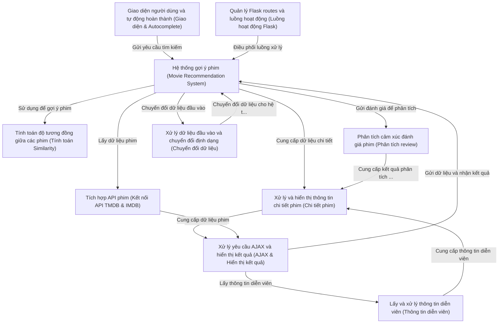

# Documentation: netflix-rec

**Netflix-rec** là một ứng dụng web giúp người dùng *tìm kiếm* và *gợi ý phim* dựa trên tên phim mà bạn nhập vào. Ứng dụng sử dụng **xử lý ngôn ngữ tự nhiên** và **tính toán độ tương đồng** để đề xuất các bộ phim tương tự, đồng thời hiển thị *thông tin chi tiết*, *diễn viên*, *poster*, và *phân tích cảm xúc đánh giá* từ IMDB. Giao diện thân thiện với tính năng *tự động hoàn thành* giúp bạn dễ dàng tìm kiếm và khám phá những bộ phim mới một cách nhanh chóng và tiện lợi.

## Chapters

1. [Giao diện người dùng và tự động hoàn thành (Giao diện & Autocomplete)
](01_giao_diện_người_dùng_và_tự_động_hoàn_thành__giao_diện___autocomplete__.md)
2. [Xử lý yêu cầu AJAX và hiển thị kết quả (AJAX & Hiển thị kết quả)
](02_xử_lý_yêu_cầu_ajax_và_hiển_thị_kết_quả__ajax___hiển_thị_kết_quả__.md)
3. [Quản lý Flask routes và luồng hoạt động (Luồng hoạt động Flask)
](03_quản_lý_flask_routes_và_luồng_hoạt_động__luồng_hoạt_động_flask__.md)
4. [Hệ thống gợi ý phim (Movie Recommendation System)
](04_hệ_thống_gợi_ý_phim__movie_recommendation_system__.md)
5. [Xử lý dữ liệu đầu vào và chuyển đổi định dạng (Chuyển đổi dữ liệu)
](05_xử_lý_dữ_liệu_đầu_vào_và_chuyển_đổi_định_dạng__chuyển_đổi_dữ_liệu__.md)
6. [Tính toán độ tương đồng giữa các phim (Tính toán Similarity)
](06_tính_toán_độ_tương_đồng_giữa_các_phim__tính_toán_similarity__.md)
7. [Tích hợp API phim (Kết nối API TMDB & IMDB)
](07_tích_hợp_api_phim__kết_nối_api_tmdb___imdb__.md)
8. [Xử lý và hiển thị thông tin chi tiết phim (Chi tiết phim)
](08_xử_lý_và_hiển_thị_thông_tin_chi_tiết_phim__chi_tiết_phim__.md)
9. [Lấy và xử lý thông tin diễn viên (Thông tin diễn viên)
](09_lấy_và_xử_lý_thông_tin_diễn_viên__thông_tin_diễn_viên__.md)
10. [Phân tích cảm xúc đánh giá phim (Phân tích review)
](10_phân_tích_cảm_xúc_đánh_giá_phim__phân_tích_review__.md)
